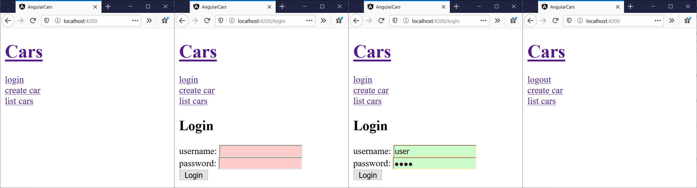
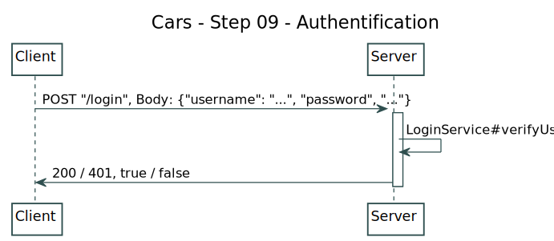
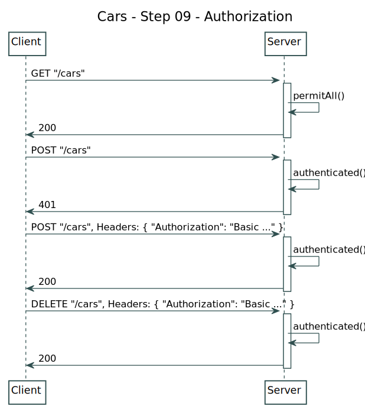

# Cars

Implement a car client / server application.

## Installation

En utilisant MySQL:

- Installer [docker](https://www.docker.com/get-started)
- Exécuter la dernière image mysql `docker run --name mysql_renault -e MYSQL_ROOT_PASSWORD=12345 -d mysql:latest`
- S'assurer que l'image "mysql_renault" s'exécute avec `docker ps` (copier / coller le port dans application.yml)
- Trouver l'IP du container docker `docker inspect mysql_renault` (copier / coller le port dans application.yml)

En utilisant Postgresql

- Utiliser l'installation de Frank (mettre les bonnes valeurs dans application.yml)

## Démarrer le serveur

Configurer la bdd dans [application.yml](./src/main/resources/application.yml) avec la bdd choisie. Démarrer le serveur Spring Boot ([http://localhost:8008](http://localhost:8008)):

```bash
# Linux & MacOS
./gradlew bootRun

# Windows
gradlew bootRun
```

## Content

### Step 1 (semaine 3)

For the first step, implement the "TODO step 1" comments.

- In `CarsService`, implement the `getBrands()` method:
    - The method should return the brands from the .csv
    - For example: "BMW", "Cadillac", etc.
- In `CarsServlet`, implement the `goGetHtml()` method:
    - Forward the request to the ".jsp" file
    - Add the set of brands to the request attributes
- In `cars.jsp` page, implement the loop to show the buttons:
    - Use a `for` loop, in the loop, use the `<%= variable %>` syntax
    - The buttons should show as: `<button data-brand="BMW">BMW</button>`

### Step 2 (semaine 3)

For the second step, implement the "TODO step 2" comments.

- In `CarsService`, implement the `getCars()` method:
    - The method should return the cars from the .csv
    - The method should filter on the provided argument
    - Use the `Car` constructor with the brand and model
- In `CarsServlet`, implement the `goGetJson()` method:
    - Use [JSON-P](https://javaee.github.io/jsonp/getting-started.html) to convert to JSON
    - Use `PrintWriter writer = response.getWriter()` to print the output
- In `cars.jsp` page, implement the js to send the request to the server:
    - Use the [`fetch` API](https://developer.mozilla.org/en-US/docs/Web/API/Fetch_API/Using_Fetch)
    - Send a request to the proper URL for example "http://localhost:8080/dubreuia-cars/cars?brand=BMW"
    - Put the content in the `div` element with the "content" id
    
### Step 3 (semaine 4)

For the third step, start a MySql server using Docker, and use Java to insert and query data in the database.

- Start a MySql database
    - Install [docker](https://www.docker.com/get-started)
    - Run latest mysql image `docker run --name mysql_renault -e MYSQL_ROOT_PASSWORD=12345 -d mysql:latest`
    - Run latest mysql image (windows) `docker run --name mysql_renault -e MYSQL_ROOT_PASSWORD=12345 -d -P mysql:latest`
    - Make sure the "mysql_renault" image is running `docker ps` (note the port on windows, it will change)
    - Use inspect to find the IP of the running docker `docker inspect -f '{{range .NetworkSettings.Networks}}{{.IPAddress}}{{end}}' mysql_renault`
    - Try connecting to it using docker `docker run -it --rm mysql mysql -h 172.17.0.2 -u root -p` (password: 12345)
    - Try connecting to it using docker (windows) `winpty docker run -it --rm mysql mysql -h 172.17.0.2 -u root -p` (password: 12345)
    - In Mysql, you need to create a database first, use `CREATE DATABASE renault`
    - Then use the database using `USE renault`
    - (`docker stop mysql_renault`, `docker ps -a`, `docker start mysql_renault`)
    - (`docker inspect mysql_renault` show volume)
    - (`docker rm mysql_renault` loses data!)
    - (`docker image list`, `docker image rm`)
- Use Java to modify and query the database 
    - Add the Mysql connector jar to build.gradle `https://mvnrepository.com/artifact/mysql/mysql-connector-java`
    - In `CarsDatabaseInsert` read the "cars.csv" file and insert the content in the database
    - Use the connection `DriverManager.getConnection("jdbc:mysql://172.17.0.2:3306/renault", "root", "12345");`
    - Modify the `CarService` class to read from the database instead of the "csv" file

### Step 4 (semaine 5)

We'll convert the application to a Spring application. Use the "deployToTomcat" task to deploy to tomcat.

- MySQL
    - Start the MySql database using docker
    - Create the "renault" database and the "cars" table
    - Insert the data in the cars database using `CarsDatabaseInsert`
- Spring
    - Add the spring-boot-starter-data-jpa jar to the build file
    - Create the application.yml file for Spring
    - Convert the `Car` class to an `Entity`
    - Add content to the `CarsRepository` class
    - Modify the `CarsServlet` class to use the new `CarsRepository`

Bonus (CMS):

- Add a "Add new vehicule" button
- Add a "Modify vehicule" button

### Step 5 (semaine 8)

Change the Servlet to a controller, deploy the Spring application to a Tomcat (https://www.baeldung.com/spring-boot-war-tomcat-deploy).

### Step 6 (semaine 9)

Migrate the application to angular (step 1):

- Create a root component for the app
- Create a BrandList component for the brands list
- Create a CarList component for the cars list
- Uses fetch to GET the backend

### Step 7 (semaine 10)

Add DELETE and POST:

- Add a delete button for each car (frontend and backend)
- Add a create form to create a new car (frontend and backend)
- Update components states when a new car (and brand) is created or deleted

### Step 8 (semaine 14)

Les opérations d'ajout d'un véhicule et de suppression de véhicule ne peuvent être effectués que par un utilisateur authentifié et autorisé.



Nous allons implémenter cette fonctionnalité en 2 parties : (1) l'authentification avec l'ajout d'un formulaire de login et (2) l'autorisation avec l'ajout de règle de validation par URL et méthode.

#### Step 8 - Ajout de l'authentification

L'authentification consiste à la vérification de l'identité (comprend aussi la création et la sécurisation), voir [https://en.wikipedia.org/wiki/Authentication](https://en.wikipedia.org/wiki/Authentication).



Référence : [https://www.baeldung.com/spring-security-login-angular](https://www.baeldung.com/spring-security-login-angular)

- SpringBoot Security (back) :
    - Ajouter au "build.gradle": `compile "org.springframework.boot:spring-boot-starter-security:2.2.4.RELEASE"`
    - Ajouter à "com.renault.config.BasicAuthConfiguration.configure(AuthenticationManagerBuilder)" un username, password, et roles
    - Créer un "LoginController" sur l'URL "/login" qui reçoit un username et password et qui appelle le "LoginService" pour valider
    - Le "LoginController" doit retourner true/false ou un code HTTP pour le front
- Angular (front) :
    - Dans le service "cars.service.ts", ajouter une méthode "login"
    - La méthode login fait un POST sur "http://localhost:8080/login" avec les identifiants en body
    - Créer un nouveau composant "login.component.ts"
    - Le composant est un formulaire pour entrer "username" et "password"
    - (vous pouvez vous baser sur le "car-form.component.html", ce sera presque identique)
    - Dans "login.component.ts", appeler la méthode "login" du service
    - Si le login est en succès, stocker le login en "session storage" : `sessionStorage.setItem('loggedIn', true)`
    - Créer un nouveau composant "logout.component.ts"
    - Ce composant remet à zéro le stockage et redirige vers la home
    - Dans le composant racine, le bouton doit changer entre login / logout en fonction de l'état du login  

#### Step 8 - Ajout de l'autorisation

L'autorisation est la spécification et application des droits liés à une identité (précédemment authentifiée), voir [https://en.wikipedia.org/wiki/Authorization](https://en.wikipedia.org/wiki/Authorization).



Référence : [https://www.baeldung.com/spring-security-login-angular](https://www.baeldung.com/spring-security-login-angular)

- SpringBoot Security (back) :
    - Ajouter à "com.renault.config.BasicAuthConfiguration.configure(HttpSecurity)" un `antMatchers` pour chaque méthode à autoriser
    - Le `antMatchers` prend une méthode HTTP et une URL, sur lequel on doit appeler `authenticated`
- Angular (front) :
    - Vérifier que les URL authentifiées retournent maintenant des 401 
    - Pour authentifier les opérations, il faut envoyer le Header "Authorization"
    - (le format est "Authorization: Basic TOKEN", ou TOKEN est la concaténation de "username:password", encodé en Base64, avec [`btoa`](https://developer.mozilla.org/en-US/docs/Web/API/WindowOrWorkerGlobalScope/btoa))
    - Dans "login.component.ts", si le login est en succès, concaténer "username:password", puis appeler `btoa` :
        ```javascript
        let base64hash = btoa(username + ':' + password);
        sessionStorage.setItem('token', base64hash);
        ```
    - Le token doit être envoyé avec les requêtes authentifiées
